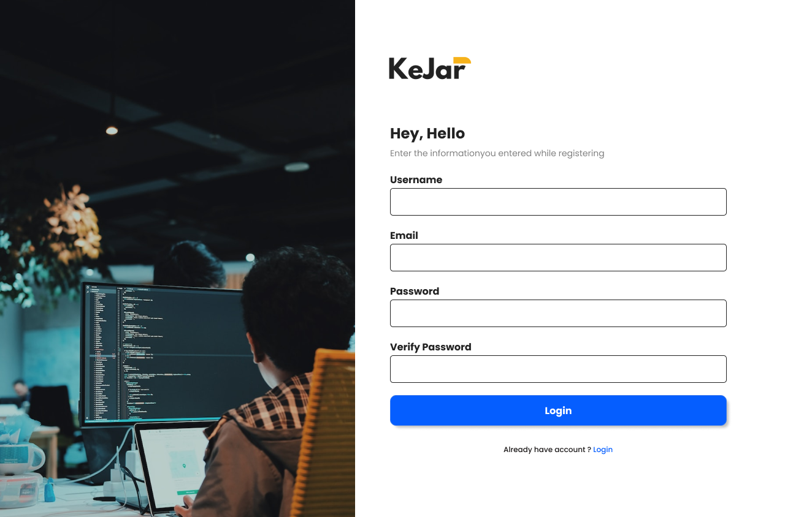

# Kejar ( Kerja Belajar )

## Welcome! 👋

Hello everyone; we are from the Kejar group.

Kejar itself is a website to help IT graduates find jobs. The KeJar website will provide the latest information about
available job vacancies in the IT field and assist IT graduates in building profiles and finding appointments that suit their skills
and expertise. In addition, the KeJar website will also provide resources and information about career opportunities in the IT field
and assist IT graduates in expanding their professional network. This website can provide significant benefits for IT graduates in
finding suitable jobs and increasing their success in careers in the IT field.

## The Features & Roles

Here we describe some of the features contained in the application

-   Login
-   Register
-   Find Job
-   Logout
-   Apply Job
-   CRUD jobs, Profile, Categories

And Then we have 3 role

-   Admin
-   Company
-   Employee

## Tech Stack

we use several tech stacks but here we focus on discussing php more precisely using the laravel framework

### Backend

-   Laravel

### Front End

-   Blade
-   Tailwind Css

### Database

-   MySql ( Database Relational Model )

## How To Clone ?

1. Clone this project using https or ssh
2. So we are using Laravel Breeze and Tailwind for styling, type the code below

```
composer install
npm install
```

3. Copy `.env.example` file to `.env` on the root folder. You can type copy `.env.example .env` if using command prompt Windows or cp `.env.example .env` if using terminal, Ubuntu
4. adjust the values that are in the `env` file like db name, db username, db password
5. Set key in `.env` using `php artisan key:generate`
6. Migrate database using `php artisan migrate`
7. After everything has been set, the final step is to type the code below

```
php artisan serve
npm run dev
```

## UIUX

1. Register Page
   

2. Login Page
   

3. Dashboard Page
   

4. Find Job Page
   

5. Job Detail Page
   

6. Learning Page
   

7. Admin Page
   

## Team project

-   Muhammad Nurul Afif Maliki - Project Manager & UIUX
-   Muhammad Rayhan Kurniawan - System Analyst
-   Alvin Renaldy Novanza - Programmer
-   Dary Ramadhan Abdussalam - Programmer
-   Andrian Saputra - Programmer
-   Nabil Egan Valentino - Programmer
